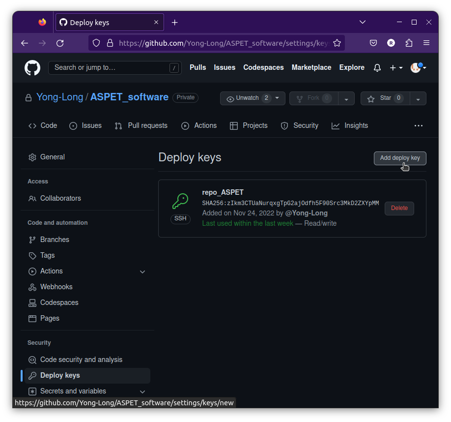
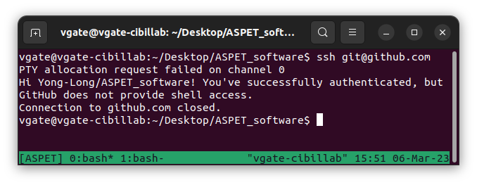

# SSH key configuration

If you just start work on this project, and your pull/push requests were rejected,
you have to generate and register authorized key pair.

------------------------------------------------------------------------------

## Generate SSH key pair

For accessing connection of the repository, please generate a valid SSH key first:
(For recognizing the purpose of this key, enter the key name with `repo_ASPET`.)

```bash
cd ~/.ssh/
ssh-keygen -C "repo ASPET - <note>"
# >> Enter key name: 'repo_ASPET'
```

------------------------------------------------------------------------------

## Register SSH key pair

After generate a new SSH key pair, you should register them both
on your local session and GitHub repo respectively.

### Register private key on local session

```bash
ssh-agent bash
ssh-add ~/.ssh/repo_ASPET
```

### Register public key on GitHub session

To register public key on GitHub, you should print out and copy public content,
and paste it to GitHub `Deploy keys` section.

```bash
cat repo_ASPET.pub
# 1. Copy content of public key
# 2. Go to ASPET repository `Setting` tab > `Deploy keys`
# 3. Register this key and save
```



------------------------------------------------------------------------------

## Verify GitHub repo connection

Every time when accessing repo, you should test connection with this command:

```bash
ssh git@github.com
```

And you should see following message:  


If it is not working, probably the issue came from the conflict of multiple SSH keys.
You can solve it by openning a new SSH session and register the private key again.

```bash
ssh-agent bash
ssh-add ~/.ssh/repo_ASPET
```

or creating a `config` file in `~/.ssh/` for managing multiple SSH keys.

```txt
# - Github repo keys -
Host repo_ASPET
    HostName github.com
    User git
    IdentityFile ~/.ssh/repo_ASPET
```

Then you can test connection by alias of the host name in `config` file:

```bash
ssh repo_ASPET
```
